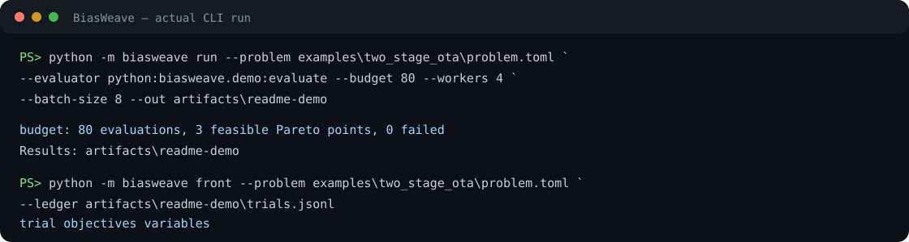

# BiasWeave

[](https://github.com/appleweiping/BiasWeave/actions/workflows/ci.yml)
[](https://github.com/appleweiping/BiasWeave/actions/workflows/codeql.yml)
[](https://www.python.org/)
[](LICENSE)

BiasWeave is a dependency-free Python toolkit for reproducible, constraint-first, multi-objective device-sizing
searches. It explores continuous, integer, categorical, and linked design variables, keeps an exact feasible Pareto
front, and writes an append-only record that can be resumed without losing proposal state.

The optimizer is evaluator-agnostic. A trusted Python function or an executable receiving JSON can connect it to an
analytic model, a simulator wrapper, or a measured-data workflow. BiasWeave never runs a shell and never assumes that
metric names carry units.

## Why it exists

Analog sizing is rarely a single-score problem. Power and area are often minimized while gain, bandwidth, phase margin,
noise, or yield remain hard constraints. BiasWeave makes that distinction explicit:

- feasible points always outrank infeasible points;
- infeasible points are ordered by normalized constraint violation;
- feasible points use exact Pareto dominance across all objectives;
- three deterministic proposal strands provide global coverage, frontier refinement, and constraint repair;
- every evaluated point, including evaluator failures, receives a stable trial ID;
- a checkpoint contains enough state to continue the same search sequence.

BiasWeave is an optimizer and experiment recorder. It is not a circuit simulator, compact model, PDK, sign-off tool, or
guarantee of global optimality.

## Requirements and installation

Python 3.11 or newer is required. The runtime has no third-party dependencies.

```console
python -m pip install .
```

For a contributor environment:

```console
python -m pip install -e ".[dev]"
```

## Quick start

Validate and run the bundled transparent teaching example:

```console
biasweave validate --problem examples/two_stage_ota/problem.toml
biasweave run \
  --problem examples/two_stage_ota/problem.toml \
  --evaluator python:biasweave.demo:evaluate \
  --budget 80 --workers 4 --batch-size 8 \
  --out artifacts/two-stage-ota
biasweave front \
  --problem examples/two_stage_ota/problem.toml \
  --ledger artifacts/two-stage-ota/trials.jsonl
```

The example equations are synthetic and documented as such. They demonstrate the interface; they do not predict a
fabricated circuit.



Continue an interrupted or completed checkpoint with 20 more evaluations:

```console
biasweave resume \
  --problem examples/two_stage_ota/problem.toml \
  --evaluator python:biasweave.demo:evaluate \
  --additional-budget 20 --workers 4 --batch-size 8 \
  --out artifacts/two-stage-ota
```

The problem digest, evaluator identifier, seed, and batch size must match the checkpoint. This prevents an accidental
continuation under changed semantics.

## Problem format

Problems are strict TOML documents with `schema_version = 1`. Unknown fields are rejected so misspellings cannot
silently alter a run.

```toml
schema_version = 1

[variables.width_m]
kind = "real"
low = 1e-6
high = 100e-6
scale = "log"
default = 10e-6

[variables.fingers]
kind = "integer"
low = 1
high = 16

[variables.flavor]
kind = "choice"
values = ["standard", "low_leakage"]

[variables.mirror_width_m]
kind = "linked"
source = "width_m"
factor = 0.5

[[objectives]]
metric = "power_w"
goal = "min"
scale = 1e-3
epsilon = 0.02

[[objectives]]
metric = "area_m2"
goal = "min"
scale = 1e-9
epsilon = 0.02

[[constraints]]
metric = "gain_db"
relation = "ge"
limit = 60.0
scale = 10.0
```

Variable kinds:

- `real` requires finite `low < high`; `scale` is `linear` or `log`, and optional `quantum` snaps values.
- `integer` requires integer inclusive bounds.
- `choice` requires a non-empty unique array of finite numbers or strings.
- `linked` computes `source * factor + offset` and consumes no search coordinate.

Objective `goal` is `min` or `max`. Its positive `scale` normalizes the objective vector. `epsilon` is used only to
select sparse proposal anchors; it does not approximate or discard the exact reported Pareto front.

Constraint relations are:

- `ge`: value must be at least `limit`;
- `le`: value must be at most `limit`;
- `between`: value must be between `lower` and `upper`.

Positive `scale` normalizes violations across differently sized metrics. Optional non-negative `tolerance` widens the
accepted boundary in the metric's own units.

BiasWeave has no unit conversion layer. Use a consistent system in both problem and evaluator. The example uses SI for
physical quantities and explicitly names dimensions such as `_m`, `_a`, `_f`, `_hz`, and `_w`.

## Evaluators

### Trusted Python callable

The evaluator receives an immutable-by-convention mapping of decoded variable values and returns a metric mapping:

```python
def evaluate(point):
    return {
        "power_w": 1.8 * point["bias_current_a"],
        "area_m2": point["width_m"] * point["length_m"],
        "gain_db": 65.0,
    }
```

Reference it as `python:package.module:evaluate`. Importing Python code executes module-level code, so only load an
evaluator you trust.

### JSON command

Use `command:` followed by a JSON argv array. One process is started per point with `shell=False`. The point is sent as
one JSON object on standard input; the process must emit one JSON metric object on standard output.

```console
biasweave run --problem problem.toml \
  --evaluator 'command:["python","evaluate.py"]' \
  --budget 40 --out artifacts/run
```

Quoting differs by terminal. The JSON array remains the source of argument boundaries, so paths containing spaces stay
single arguments. A nonzero process exit, timeout, malformed JSON, missing metric, non-numeric metric, or non-finite
metric is recorded as a failed trial instead of terminating the search.

## Outputs

An output directory contains:

- `trials.jsonl`: append-only, fsync'd record of every completed trial;
- `run.json`: atomically replaced compatibility and proposal-state checkpoint;
- `frontier.json`: deterministic machine-readable summary and complete feasible front;
- `summary.md`: compact human-readable run summary.

A malformed complete ledger line is rejected. A truncated final line without its newline is ignored, which permits
recovery after interruption during the final append. Trial IDs before that tail must be contiguous from zero.

## Python API

```python
from biasweave import load_problem, load_python_evaluator, optimize
from biasweave.model import RunConfig

problem = load_problem("problem.toml")
evaluator = load_python_evaluator("python:my_project.models:evaluate")
result = optimize(
    problem,
    evaluator,
    evaluator_id="python:my_project.models:evaluate",
    config=RunConfig(budget=100, seed=7, workers=4, batch_size=8),
    output_directory="artifacts/run-7",
)
```

The returned result exposes all trials and the feasible exact Pareto front. Parallel evaluators may finish in any order,
but BiasWeave commits their results in trial-ID order. Determinism assumes the evaluator itself is deterministic and
safe under the requested worker count.

## Development

```console
ruff check .
ruff format --check .
pytest --cov=biasweave --cov-report=term-missing
python -m build
```

See [the architecture notes](docs/architecture.md) for invariants and persistence boundaries. Contributions follow
[CONTRIBUTING.md](CONTRIBUTING.md); security reports follow [SECURITY.md](SECURITY.md).

## License

BiasWeave is released under the MIT License.
